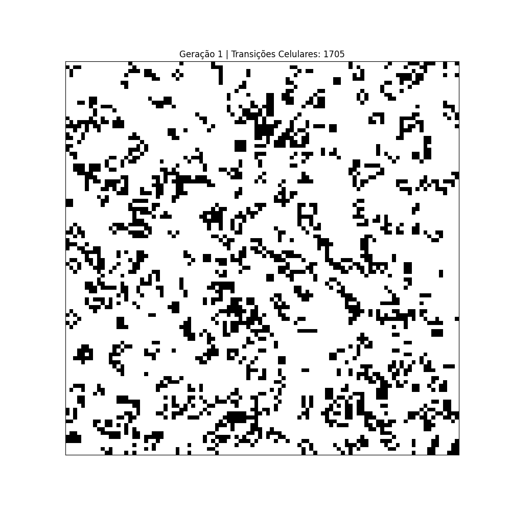
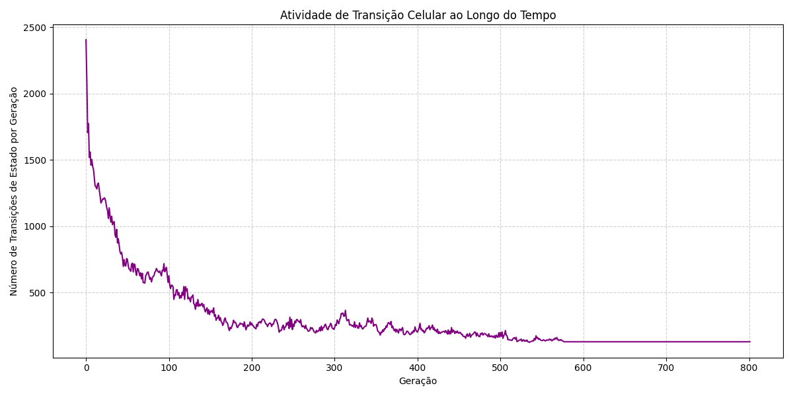
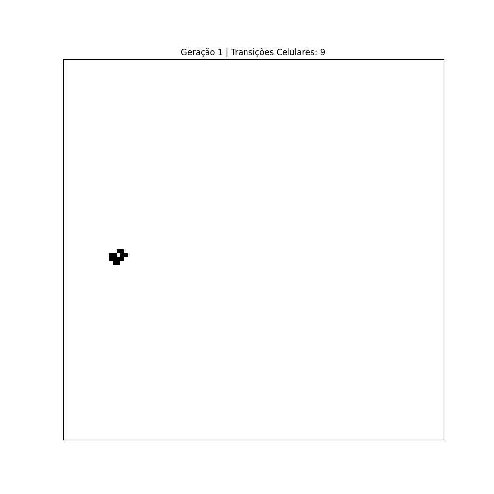
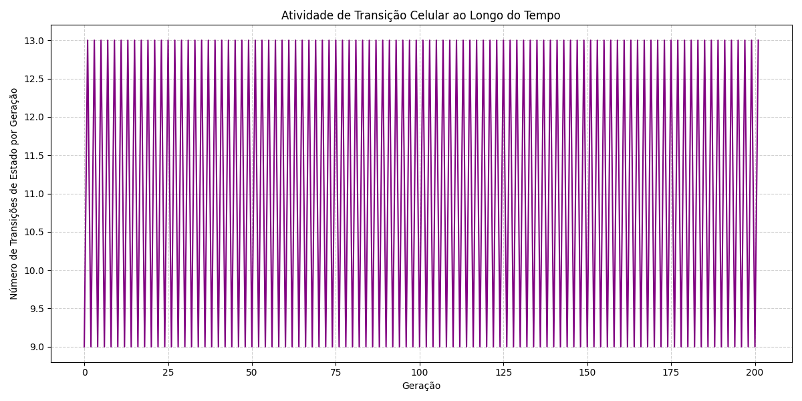

# 📊 Jogo da Vida — Simulação, Dinâmica Emergente e Análise de Estabilidade

Implementação do **Jogo da Vida de Conway** em Python com visualização e análise de dinâmica emergente.

## 🧬 O que é?

O Jogo da Vida é um autômato celular criado por John Conway em 1970. É um sistema de evolução determinística onde células em uma grade evoluem seguindo regras simples:

- Uma célula **morta** com exatamente 3 vizinhos vivos → **nasce** 🐣
- Uma célula **viva** com 2 ou 3 vizinhos vivos → **sobrevive** ✨
- Todos os outros casos → célula **morre** 💀

Apesar da simplicidade, o sistema produz comportamentos emergentes complexos como osciladores, naves espaciais e estruturas estáticas.

## 🎯 Características

- ✅ Simulação completa das regras do Jogo da Vida
- 🔧 Configuração flexível de padrões iniciais
- 🎨 Visualização em tempo real com matplotlib
- 📊 Análise de atividade celular ao longo das gerações
- 🎬 Exportação de animações em GIF
- 📈 Gráficos de transições de estado

## 🚀 Como rodar

```bash
# Clonar o repositório
git clone https://github.com/diegobrnrd/cellular-automata.git
cd cellular-automata

# Instalar dependências
pip install -r requirements.txt

# Executar
python jogo_da_vida.py
```

## ⚙️ O que faz

O programa simula 800 gerações do Jogo da Vida em uma grade 100×100 e gera:

- `simulacao_do_jogo_da_vida.gif` — animação da evolução celular 🎬
- `atividade_transicao_celular.png` — gráfico de mudanças por geração 📊

### 🎛️ Configurações disponíveis

No arquivo `jogo_da_vida.py`, você pode ajustar:

```python
TAMANHO_GRADE = 100      # Dimensão da grade (NxN)
INTERVALO_MS = 50        # Intervalo entre frames (ms)
TOTAL_GERACOES = 800     # Número de gerações a simular
SEMENTE = 16             # Seed para padrão aleatório
```

### 🔀 Alternando padrões

Edite as linhas 95-96 para escolher o padrão inicial:

```python
# Padrão aleatório (seed 16)
grade = carregar_padrao("random")

# Padrão LWSS (Lightweight Spaceship)
# grade = inserir_padrao(grade, "lwss", (50, 10))
```

## 📸 Exemplos

### 🎲 Random (seed 16)

Configuração inicial aleatória que evolui para estruturas estáveis e oscilantes. Com 20% de células vivas inicialmente, o sistema rapidamente converge para um estado de baixa atividade com padrões periódicos.



**Atividade de transição:**



📉 **Análise:** Observe como a atividade começa alta e rapidamente decai, estabilizando em pequenas oscilações. Isso indica que o sistema atingiu um equilíbrio entre estruturas estáticas (still lifes) e osciladores.

---

### 🚀 LWSS (Lightweight Spaceship)

Padrão clássico que se move diagonalmente pela grade. O LWSS é uma "nave espacial" — uma estrutura que se desloca mantendo sua forma original.



**Atividade de transição:**



🔄 **Análise:** A atividade mostra um padrão periódico consistente, refletindo o movimento cíclico da nave. Cada pico representa o LWSS completando uma fase de seu ciclo de movimento.

## 📄 Artigo

Para uma análise detalhada dos fundamentos teóricos e resultados experimentais, consulte o artigo completo incluído neste repositório.

📖 [Dinâmica Emergente e Complexidade em Autômatos Celulares](Dinâmica%20Emergente%20e%20Complexidade%20em%20Autômatos%20Celulares%20Uma%20Implementação%20Computacional%20e%20Análise%20de%20Estabilidade%20do%20Jogo%20da%20Vida%20de%20Conway.pdf)

## 🛠️ Tecnologias


## 📜 Licença

Este projeto é de código aberto e está disponível para uso educacional e pesquisa.
